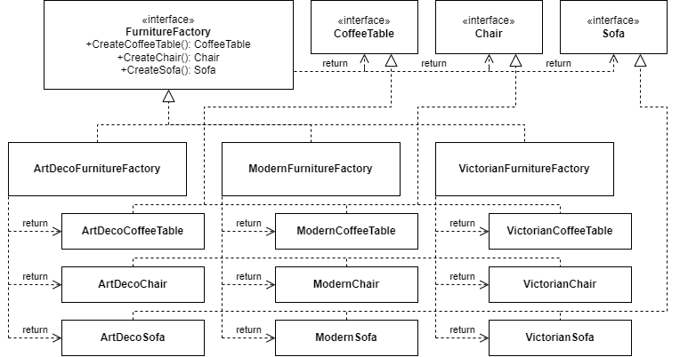

# Furniture-Shop

**Abstract Factory** example.

- our _Abstract Products_ are **CoffeeTable**, **Chair** and **Sofa**, outlined as interfaces
- our _Concrete Products_ are grouped/categorised as ArtDeco, Victorian and Modern
- we use the _Abstract Factory_ pattern to use a consistent interface to instantiate the different _Concrete Products_